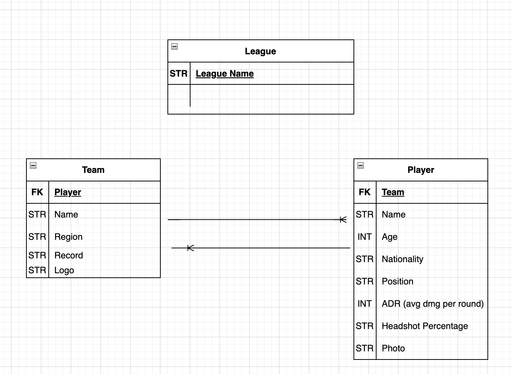

# csgoCompanion
csgoCompanion is a site made to keep Counter Strike fans up to date with their favorite team's and player's stats.

## Goals 
The goal of this project is to create a web based application using Django, React, and Axios to render my data on screen.

## ERD

## Component Hierarchy Diagram

## Wireframe

## Stretch Goals
- Connect third party API to keep all stats updated as the season progresses.
- User authentication